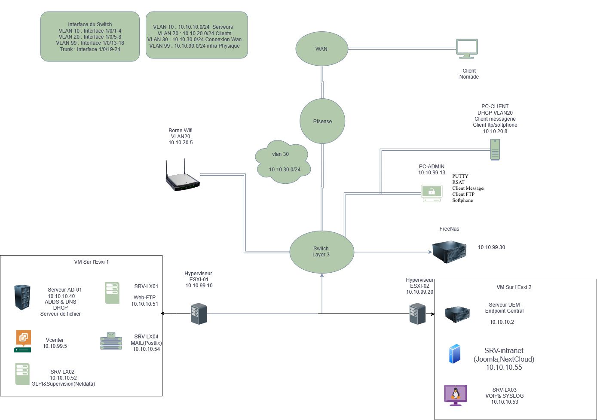

# Projet Final TSSR – Infrastructure PME

**Projet de fin de formation TSSR 2025** · groupe de 7 · du 22/09 au 02/10/2025

> ## 📄 [Consulter le rapport final (PDF, 81 pages)](Docs/rapport-final-infra-pme-tssr-2025.pdf)
>
> Le document complet : contexte et cahier des charges, architecture technique, services déployés, stockage et sauvegardes, sécurisation, exploitation, contribution de l'équipe, bilan et annexes techniques.
>
> [Télécharger le PDF](Docs/rapport-final-infra-pme-tssr-2025.pdf?raw=true) · [Source du schéma (.drawio)](Docs/Diagrammes/topologie-finale.drawio)

---

## 📌 Contexte

Une PME spécialisée dans la vente d'articles de sport ouvre ses portes.
Elle a besoin d'une infrastructure informatique robuste, virtualisée et sécurisée, afin de répondre aux besoins de ses équipes internes et des agents nomades.

Ce projet constitue le **projet de fin de formation TSSR**, avec pour objectifs :

- Mettre en place une infrastructure virtualisée hautement disponible.
- Fournir les services essentiels (AD, DNS, DHCP, GLPI, VoIP, supervision, messagerie…).
- Sécuriser l'accès via un pare-feu pfSense et la segmentation VLAN.
- Centraliser l'administration via **vCenter**.
- Garantir la sauvegarde et la redondance des données avec un SAN iSCSI.

---

## 🖥️ Schéma d'architecture

---

## 🌐 Plan d'adressage

| VLAN  | Usage               | Réseau        | Passerelle (SVI) | Notes |
|-------|---------------------|---------------|------------------|-------|
| 10    | Serveurs            | 10.10.10.0/24 | 10.10.10.1       | AD, DNS, DHCP, Fichiers, MDM, CMS, FTP, GLPI, Supervision |
| 20    | Clients             | 10.10.20.0/24 | 10.10.20.1       | Postes utilisateurs & nomades |
| 30    | Connexion WAN       | 10.10.30.0/24 | 10.10.30.1       | Sortie Internet via pfSense |
| 99    | Infra Physique      | 10.10.99.0/24 | 10.10.99.1       | ESXi, SAN, VCSA |

---

## 🛠️ Services déployés

### Windows

- **SRV-AD01** : Active Directory, DNS, DHCP, serveur de fichiers
- **SRV-MDM** : ManageEngine Mobile Device Manager Plus

### Linux

- **SRV-LX01** : CMS (HTTP/HTTPS), FTP(s)
- **SRV-LX02** : GLPI & supervision (Zabbix)
- **SRV-LX03** : VoIP & Syslog (prévu)
- **SRV-LX04** : serveur de messagerie (Postfix, prévu)

### Autres équipements

- **pfSense** : pare-feu, proxy, VPN nomade
- **Switch L3 Cisco** : routage inter-VLAN
- **SAN iSCSI** : stockage VMDATA et ISO
- **vCenter** : gestion centralisée des hyperviseurs ESXi

---

## 👥 Équipe & rôles

- **Administrateur Système** → gestion AD, DHCP, fichiers, MDM
- **Administrateur Réseau** → switch L3, VLANs, pfSense, routage
- **Administrateur Virtualisation** → ESXi, vCenter, SAN
- **Responsable Applicatifs** → GLPI, supervision, CMS, VoIP, mail

---

## 🎯 Livrables

- **Rapport final** : [rapport-final-infra-pme-tssr-2025.pdf](Docs/rapport-final-infra-pme-tssr-2025.pdf) — 81 pages
- **Schéma d'architecture** : [topologie-finale.png](Docs/Diagrammes/topologie-finale.png) et sa [source draw.io](Docs/Diagrammes/topologie-finale.drawio)
- **Configurations** : switch L3, pfSense, machines virtuelles

---

## 📅 Soutenance

Soutenance orale le **02 octobre 2025**.
